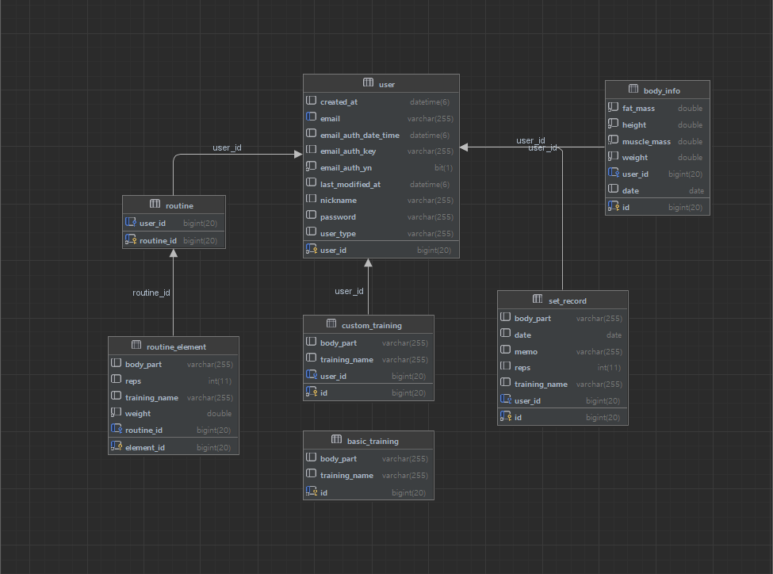

# FitnessRecord
운동(웨이트 트레이닝) 기록 서비스

## Skills
- Java 11, Spring Boot 2.7.10, gradle 8.2.1
- Spring Data JPA, Spring Security
- MariaDB
- JUnit5
- Redis
- IntelliJ Idea

### 라이브러리
- google GSON
- Gmail smtp 메일 발송
- Swagger `/swagger-ui/index.html`

# 요구사항 

## 회원 관리
### 공통
- 로그인 시 JWT accessToken과 refreshToken이 발행된다.
- 이후 `Authorization` 헤더에 `Bearer {token}`을 추가하여 권한을 확인한다.

### 토큰 관리
- redis로 refreshToken과 로그아웃 된 accessToken을 관리한다.
- refreshToken으로 reissue 요청 시 accessToken을 새로 발행한다.
- 로그아웃 시 해당 refreshTokend을 삭제하고, accessToken에 대한 blackList를 추가하여, 이후 해당 accessToken으로 로그인 할 시 거부되도록 한다. 

### 이메일 회원
- 이메일, 비밀 번호를 통해 로그인 할 수 있다.
- 이메일로 회원가입 할 수 있다.`UserType.BASIC`
  - 회원가입 시 인증 메일이 발송되고, 메일 인증을 완료되어야지만 서비스를 이용할 수 있다.
  - 이메일 발송 시에 5초 정도의 시간이 소요되므로 `비동기`로 처리한다.
  - 이메일 인증 기한은 24시간이다. 기한 내에 인증하지 못한 경우 새로운 인증 키로 재발송한다.

### 소셜 회원
- `KAKAO`, `(추가 예정)`
- `/login-page`에서 소셜 로그인을 통해 회원가입, 로그인 할 수 있다.
  - REST API를 제공하는 애플리케이션이지만 인증 코드를 불러오는부분 까지만 thymeleaf form을 사용한다. 
- 처음 로그인 시에는 회원가입이 되고, 이후에는 로그인이 된다.

### 회원 바디 데이터 기록
- 회원은 키, 몸무게, 골격근량, 체지방량을 입력할 수 있다.
  - 회원이 바디 데이터를 추가할 때 마다 몸 상태 변화가 기록된다.
  - 회원 Body 데이터 추가는 하루에 한번만 가능하다. 여러번 추가 시 기존 데이터가 수정되게 된다.
- 회원은 특정 날짜의 바디 데이터를 삭제할 수 있다.
- 회원은 특정 기간의 바디 데이터 변화 리스트를 조회할 수 있다.
(프론트에서 회원 몸 상태 변화 그래프를 보여줄 때 사용)

## 운동 종목 (카테 고리)
- 기본적으로 서비스에서 제공하는 운동 종목`BASIC_TRAINING 테이블` 존재
  - ADMIN 권한을 가진 유저는 BasicTraining을 CRUD 할 수 있다.
- 이외의 회원 개인 별 커스텀 운동 종목 추가 가능
  - `CUSTOM_TRAINING 테이블`에서 관리한다.

## 회원 운동 기록
### 회원 별 운동 기록 제공
- 회원은 자신의 운동 내역(`TRAINING_RECORD 테이블`)을 기록할 수 있다.
- 운동 내역은 세트별(`SET_RECORD 테이블`)로 기록한다.
  - `SET_RECORD`는 `TRAINING_RECORD`에 포함된다.
  - `SET_RECORD`는 추가, 삭제만 가능하다.
  - `SET_RECORD` 수정시 `redisson LOCK`을 획득하도록 하여 동시성문제를 해결한다.
- 일정 기간 사이의 운동 기록을 조회할 수 있다. (query param: d1, d2)

### 운동 기록 데이터 정리 스케쥴링
- 하루가 끝나면 운동 기록 별로 `가슴/등/하체/어깨/이두/삼두/기타` 대분류로 운동 volume을 기록한다.`(VOLUME_RECORD)매일 오전 2시로 Scheduling`
  - 과거(하루 이전)의 SetRecord 수정 시에 VolumeRecord도 업데이트 된다. 
- 한 주가 끝나면 주간 운동 기록을 유저 별로 따로 저장한다. `(WEEKLY_RECORD) 매주 화요일 2주전의 데이터 저장`

## 루틴 만들기
- 회원은 자신만의 루틴을 만들 수 있다.
- 하나의 루틴은 여러개의 `ROUTINE_ELEMENT`로 구성된다.
- `ROUTINE_ELEMENT`를 `ROUTINE`에 추가, 삭제할 수 있다.
  - 추가, 삭제 시 OrderNumber가 1부터 순차적으로 증가되는 것이 유지되도록 한다. 
- `ROUTINE_ELEMENT`의 내용을 수정할 수 있다. 
  - OrderNumber(순서)는 수정이 불가하고, 삭제, 추가만 가능하다.

### 루틴 공유 게시판 
- 회원은 자신의 루틴을 공유할 수 있다.
  - 게시글 생성, 수정, 삭제 가능
- 게시글 조회 시 views(조회수)가 1씩 증가한다. `분산 락 사용`
- [ ] 게시글에 likes(좋아요)를 누를 수 있다.
- [ ] 회원은 다른 회원이 공유한 루틴을 확인하고 댓글을 달 수 있다.
  - [ ] 다른 회원의 루틴을 저장할 수 있다.

### 회원 별 운동 통계 제공
- [ ] 일별, 주별 운동 기록, 통계를 제공한다.
- [ ] 운동 부위 별 volume 주간 통계 제공

### 운동 기록 갱신 알림
- [ ] 운동 종목 별 최고 기록 갱신 시 알림 기능 `(sse/polling/websocket 등 예정)`

## ERD

