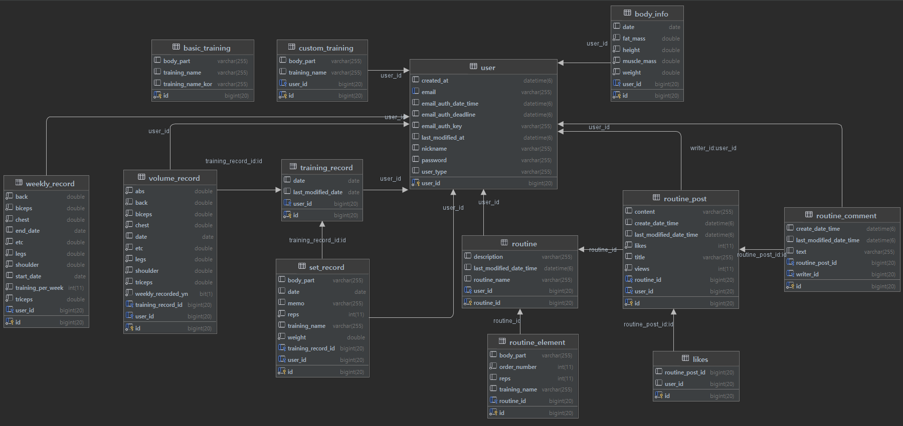

# FitnessRecord
운동(웨이트 트레이닝) 기록 서비스

## Skills
- Java 11, Spring Boot 2.7.10, gradle 8.2.1
- Spring Data JPA, Spring Security
- MariaDB
- JUnit5
- IntelliJ Idea

### 라이브러리
- google GSON
- Gmail smtp 메일 발송
- Swagger `/swagger-ui.html`

# 요구사항 

## 회원 관리
### 공통
- 로그인 시 JWT Token이 발행된다.
- 이후 `Authorization` 헤더에 `Bearer {token}`을 추가하여 권한을 확인한다.

### 이메일 회원
- 이메일로 회원가입 할 수 있다.`UserType.BASIC`
  - 회원가입 시 인증 메일이 발송되고, 메일 인증을 완료해야지 서비스를 이용할 수 있다.
  - 이메일 발송 시에 5초 정도의 시간이 소요되므로 비동기적으로 처리한다.
- 이메일, 비밀 번호를 통해 로그인 할 수 있다.

### 소셜 회원
- `KAKAO`, `(추가 예정)`
- `/login-page`에서 소셜 로그인을 통해 회원가입, 로그인 할 수 있다.
  - REST API를 제공하는 애플리케이션이지만 인증 코드를 불러오는부분 까지만 thymeleaf form을 사용한다. 
- 처음 로그인 시에는 회원가입이 되고, 이후에는 로그인이 된다.

### 회원 바디 데이터 기록
- 회원은 키, 몸무게, 골격근량, 체지방량을 입력할 수 있다.
  - 회원이 바디 데이터를 추가할 때 마다 몸 상태 변화가 기록된다.
  - 회원 Body 데이터 추가는 하루에 한번만 가능하다. 여러번 추가 시 기존 데이터가 수정되게 된다.
- 회원은 특정 날짜의 바디 데이터를 삭제할 수 있다.
- 회원은 특정 기간의 바디 데이터 변화 리스트를 조회할 수 있다.
(프론트에서 회원 몸 상태 변화 그래프를 보여줄 때 사용)

## 운동 종목 (카테 고리)
- [ ] 기본적으로 서비스에서 제공하는 운동 종목`BASIC_TRAINING 테이블` 존재
- [ ] 이외의 회원 개인 별 커스텀 운동 종목 추가 가능
  - [ ] `CUSTOM_TRAINING 테이블`에서 관리한다.

## 회원 운동 기록
### 회원 별 운동 기록 제공
- [ ] 회원은 자신의 운동 내역 기록할 수 있다.
  - [ ] 운동 내역은 세트별로 기록한다.
  - [ ] 기록한 내용은 날짜 별로 확인할 수 있다.
- [ ] 운동 종목 별 최고 기록 갱신 시 알림 기능 `sse/polling/websocket 등`
- [ ] 하루 운동이 끝나면 `가슴/등/이두/삼두/어깨/하체`의 대분류로 운동 volume을 기록한다. `Scheduling`
- [ ] 한 주가 끝나면 주간 운동 기록을 유저 별로 따로 저장한다. `Scheduling`

### 회원 별 운동 통계 제공
- [ ] 주간, 월간 운동 기록, 통계를 제공한다.
  - [ ] 운동 부위 별 volume 주간 통계 제공
  - `!!! 이후 추가 예정 !!!`

## 루틴 만들기
- [ ] 하나의 루틴은 여러개의 `ROUTINE_ELEMENT`로 구성된다.
- [ ] 회원은 자신만의 루틴을 만들 수 있다.

## 운동 커뮤니티 
( 시간이 되는대로 추가 예정 )
### 자유 게시판
- [ ] 카테고리에 상관없는 자유 게시판
### 루틴 공유 게시판
- [ ] 회원 자신의 루틴을 공유할 수 있다.
### 오늘 운동 완료 게시판
- [ ] 회원은 오늘 운동 완료 후 인증샷을 추가할 수 있다.
- [ ] 원하는 경우 오늘 운동 기록을 공유할 수 있다.

## ERD
- ERD는 아직 완성본이 아닙니다.
- 커뮤니티 기능에 대한 내용은 아직 ERD에 포함되어있지 않습니다.

